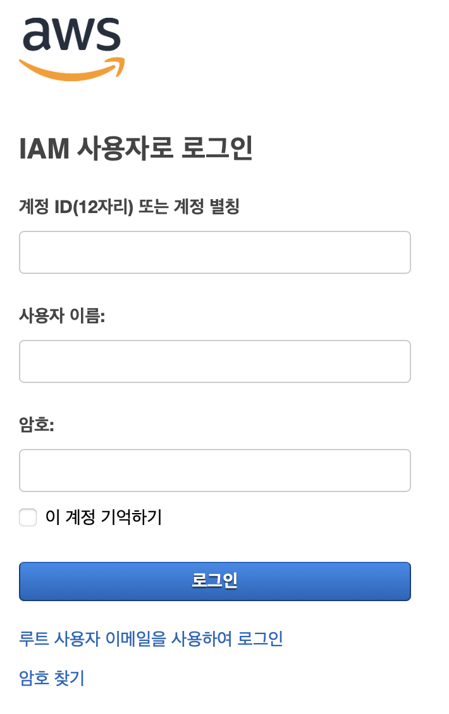
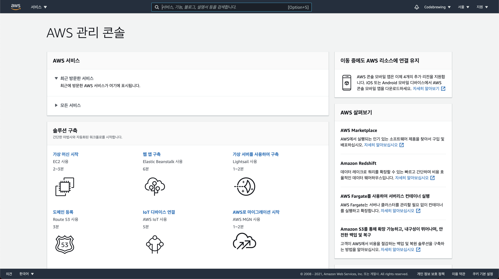
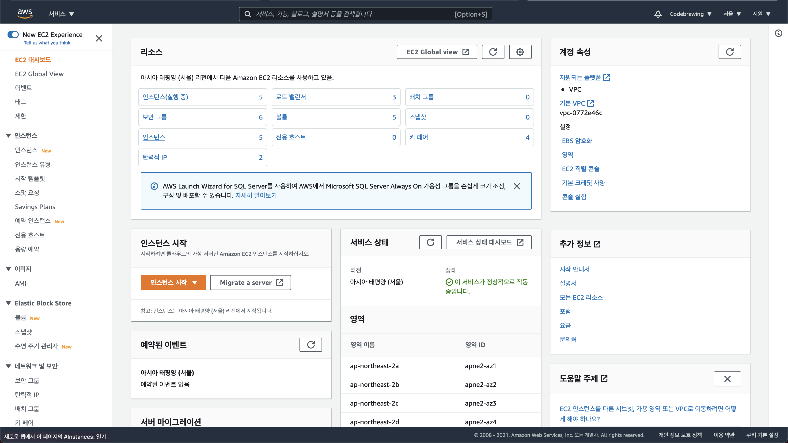
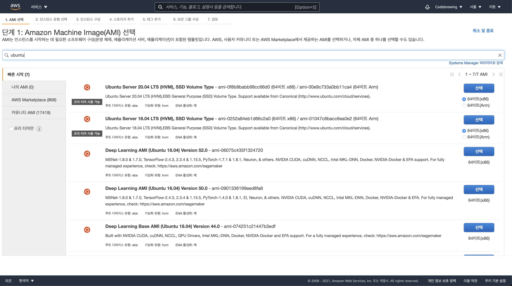
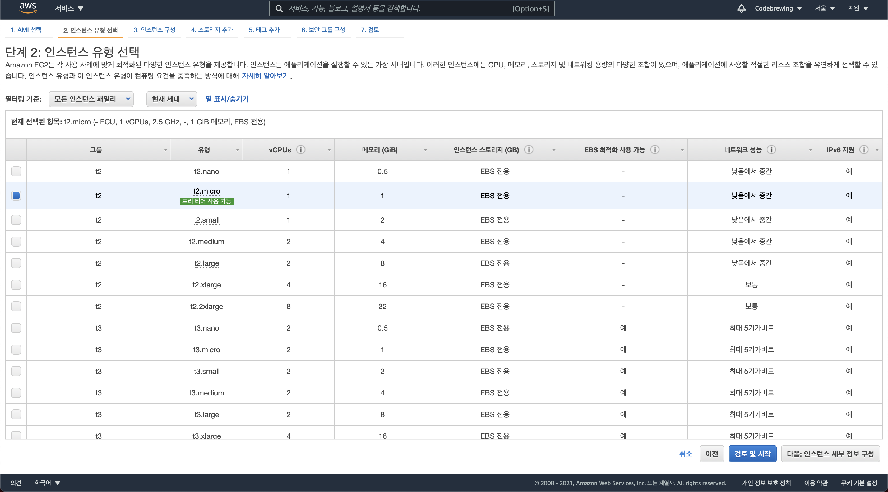
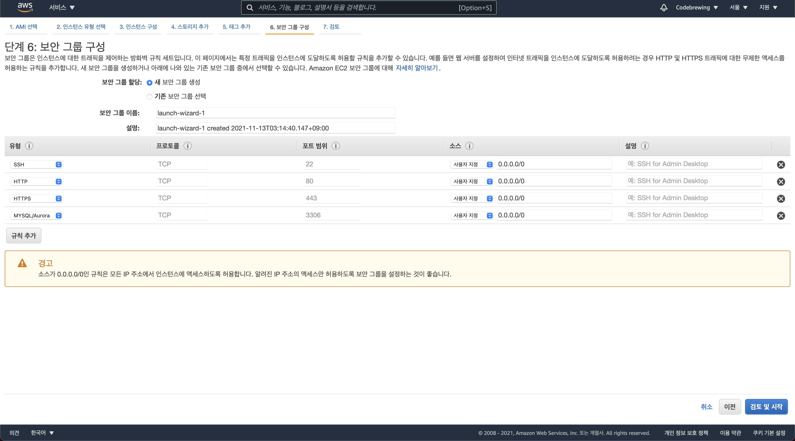
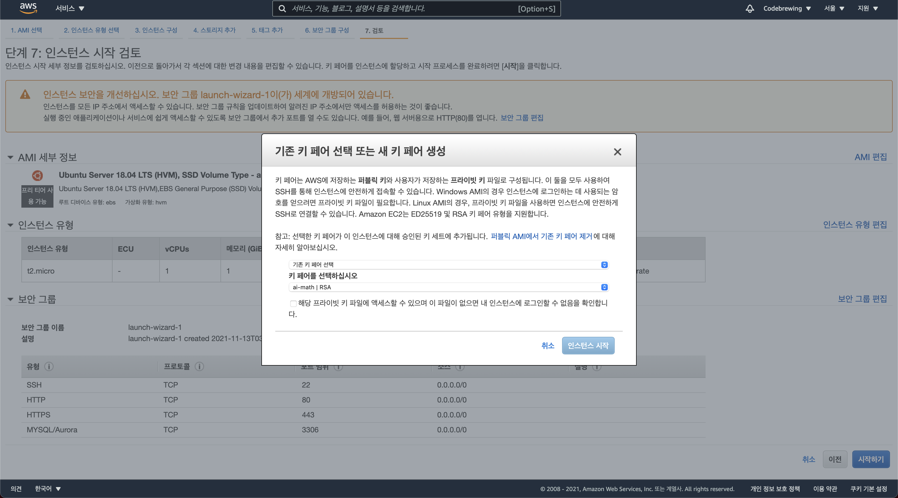

# 1. 운영환경-1
## 목차
1. AWS
    1. 계정 설정
    2. 서버 호스팅
    3. 도메인 등록
2. Freenom
    1. 도메인 구매
    2. DNS 등록

---
 

## 1. AWS
운영환경에는 여러가지가 있겠지만, 우리는 클라우드 서비스를 활용한 운영환경 조성을 해보겠습니다.

처음 해보시는 분들고 계실거고, 이미 해보신 분들도 계시겠지만, 천천히 다시 복습한다 생각하고 따라 해주신다면 감사하겠습니다.

저희가 중점을 두고 사용한 서비스는 EC2, Route53, S3, CloudFront, RDS입니다.

하나씩 천천히 진행해보겠습니다.

 

## 1-1. 계정 설정

AWS 회원가입은 다들 해오셨나요?

AWS는 아마존 사에서 서비스중인 아마존 웹 서비스, 클라우드 서비스의 일종입니다.

AWS 계정은 참 독특하게 되어 있습니다.

우리가 지난번에 봤었던 @을 기억하시나요?

> 
>
> ## ongdv@KyeongwooUI-MacBookPro
> 
>

 

AWS의 계정도 서버와 같이 설정할 수 있습니다.
루트 계정으로 로그인, IAM으로 로그인이 있습니다.

여러분들의 로그인 화면을 봐주세요.

어떻게 표시되고 있나요?

저는 이렇게 표시되고 있습니다.

 

 

우선 루트 계정으로 로그인하겠습니다.

AWS는 계정 하나에 여러 사용자를 등록할 수 있도록 해놓았습니다.

여기서 사용자는 IAM(Identify&Acess Management)를 통해서 생성할 수 있습니다.

사용자를 생서하기 전에, 계정 별칭을 먼저 설정하려고 합니다.

계정 별칭은 아까 보았던 사진에서 계정ID(12자리), 또는 계정 별칭이라고 되어 있는데, 우리가 사용하는 계정의 별칭을 지정하는 것입니다.

계정ID 12자리를 외우는 것 보다 계정별칭을 통해서 쉽게 사용하는것이 낫겠죠?

그리고 사용자 계정을 만들어 주도록 하겠습니다.

사용자 계정의 유형은 2가지로 나누어 집니다.

AWS Console Access 와 프로그램밍 Access입니다.

둘의 차이점은, 현재 우리가 보고 있는 AWS 웹 사이트를 통해서 접근하는 계정이 AWS Console Access, 웹 사이트를 통해서가 아닌 개발 도구들을 통해서 접근하는 것이 프로그래밍 액세스 방식입니다.

우선 저희는 두개 다 허용해주고, 이 계정을 저희가 사용하는 대표사용자로 둘 것입니다.

이제 다음으로 권한으로 넘어갑니다.

권한은 여러가지 옵션들을 조절하여 생성할 사용자들의 특성에 따라서 권한 관리를 하면, 역할 분담이 확실해집니다.

하지만 저희는 대표적인 사용자로 AdminAccess를 줘 놓고, 콘솔, 프로그래밍 방식 액세스에 대한 예제를 모두 진행해보겠습니다.

자, 이제 사용자 생성에 있어서 제일 중용한 부분입니다. Access Key와 Secret Key를 발급받을텐데, 이는 프로그래밍 액세스 방식에서 필요한 토큰입니다.

이 토큰들은 재발급이 가능하지만, 만약 이미 사용하고 있는 토큰이지만, 재발급을 받게 되면 다시는 사용하지 못하게 됩니다. 또한, 사용자별로 최대 3개까지 발급할 수 있기 때문에 조심해서 관리/사용해야합니다.

이렇게 사용자 생성이 끝났으니 루트 계정을 로그아웃합니다.

IAM 사용자로 로그인 해보겠습니다.

## 1-2. 서버 호스팅
운영환경에 있어서 제일 중요한게 무엇일까요?

당연히 서버입니다. 서버 컴퓨터가 있어야 웹 프로젝트를 배포할 수 있겠죠?

그래서 제일 먼저 AWS의 서버 호스팅 개념인 EC2에 대해서 배워봅시다.

EC2는 Easy Cloud Computing의 약자로 쉽게 클라우드 컴퓨터를 만들 수 있다라는 뜻입니다.

AWS 서비스에서 EC2를 검색해주세요

위와 같은 화면이 출력될텐데, 저희는 EC2인스턴트 생성을 해보겠습니다.

인스턴스 유형 중에서 Ubuntu를 검색합니다.

또한, 프리티어로 생서합니다.

프리티어는 AWS에서 자신들의 서비스를 충분히 즐겨본 후에 프로잭트에 적용해보라고 사전에 무료로 제공하는 서비스들입니다.

저희는 18.04 LTS로 설치하겠습니다.

인스턴스 유형은 [유형].[사이즈] 형태로 설명되어 있는데요, 저희는 프리티어인 t2.micro로 진행하겠습니다.

검토 및 시작을 누르시는게 아니라 다음 버튼을 눌러주세요.

---

EC2에서 제일 중요한 것은 보안 설정입니다.

EC2는 서버 컴퓨터이기 때문에 보안 설정을 진행해야하는데, AWS에서 제공하는 보안 설정 방법은 2가지입니다. 

첫번째로는 접근 가능한 아이피와 포트를 통해서 보안설정이 가능합니다.

우리는 어디서든지 접근 가능하도록 전체 개방을 해주고 시작할것입니다.

보안설정에서 위와 같이 입력해줍니다.

---

두번째로는 Key 파일을 통한 보안입니다.

아까전에 IAM 설정을 할 때처럼 키 파일을 다운받게 되는데 이는 잃어버리게 된다면 인스턴스를 통째로 초기화해야하니 잘 백업해두시길 바랍니다.

자 이제 저희 서버는 세계에 개방되어 있습니다.

이제 직접 접근하는 일만 남았습니다.

한번 접근해볼까요?

아직까지는 IP 주소로만 접근할 수 있습니다.

그래서 우리는 Route53이라는것을 이용하여 AWS 자원들을 라우팅해줄 계획입니다.

---
## 1-3. 도메인 등록
서버가 배포된 상태에서 여러가지 방법으로 도메인과 연결할 수 있습니다.

이때 필요한 것이 무엇이 있을까요?

먼저 서버에 대한 정보입니다.

우리가 가지고 있는 서버에 대한 정보는 무엇일까요?

>
> http://localhost:3333
>
> http://localhost
>
> http://127.0.0.1
>
> http://dongseo.ac.kr
>

지난번에 말씀드린 이 주소체계들을 무엇이라고 부른다고 했었나요?

네, 호스트네임입니다.

결국 도메인도 서버의 호스트네임을 추가해주는 것입니다.

그렇다면 Route53이 해주는 일이 무엇일까요?

서버에 호스트네임을 부여해주는 것입니다.